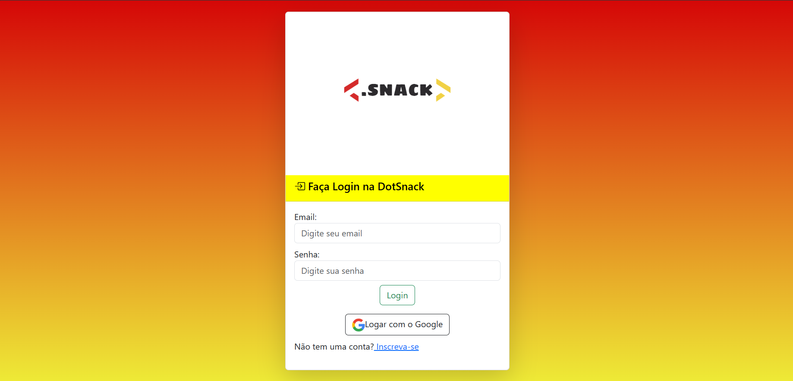
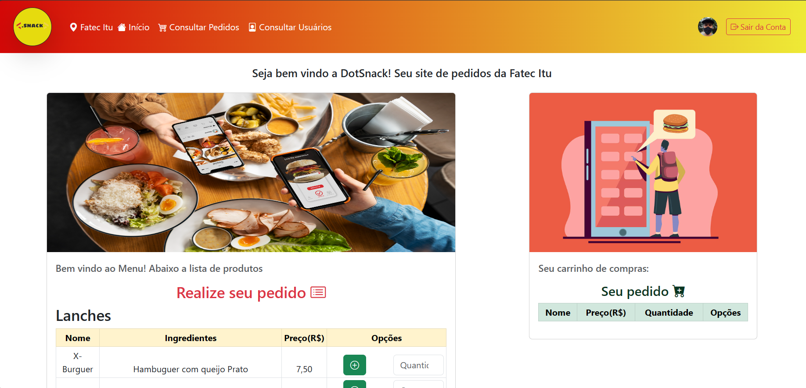
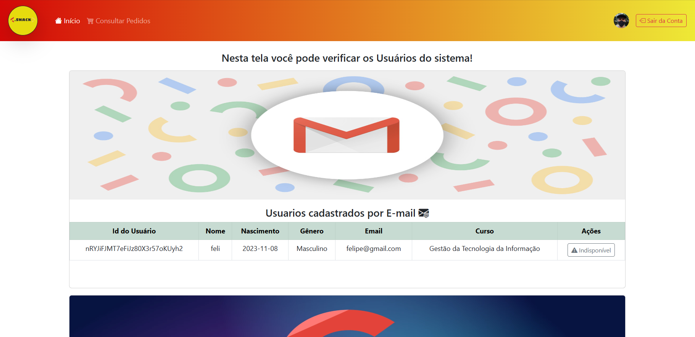
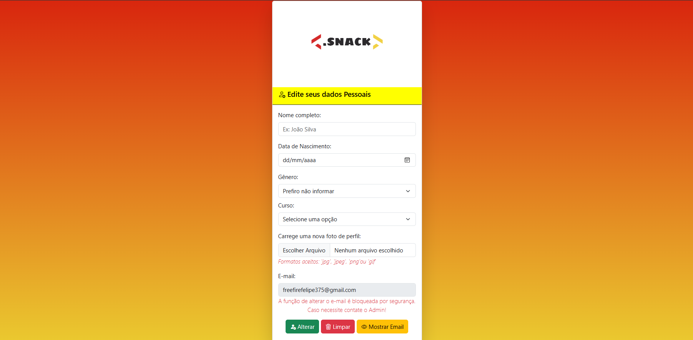

# 🌮 Lanchonete DotSnack - CRUD com autenticação integrado ao Firebase (v.9 SDK) 

Projeto em HTML, CSS e Vanilla Javascript que implementa um pequeno CRUD para inscrição de dados de uma lanchonete. (São utilizados o Realtime Database, Authentication com email/senha e conta Google e Storage do Firebase)

<p align="center"> ⭐ Projeto realizado por: Felipe Braga, Henrique da Silva e Yasmin Cardoso ⭐</p>


# 🧠 Contexto

Diante de um problema ocorrido na Fatec itu sobre os pedidos da lanchonete da faculadade, os estudantes Felipe Braga, Henrique da Silva e Yasmin Cardoso criaram um pequeno sistema de pedidos para a lanchonete, utilizando apenas HTML, Java  Script, CSS e as ferramentas do Firebase, com o Authentication, Realtime Database e Firebase Storage.

## 📋 Instruções

- [ ] Inicialmente clone o projeto; 
- [ ] Acesse https://firebase.google.com e crie um novo projeto Web.
- [ ] Edite o arquivo firebase.js e cole nele as informações de conexão apresentadas pelo Firebase.
- [ ] Acesse _Realtime Database_ e em regras, informe que apenas usuários autenticados terão direito de acesso (escrita e leitura) aos dados de pedidos, e para novos usuários(não autenticados) poderão increver-se e utilizar o Database para salvar suas informações:
```json
{
  "rules": {
     "pedidos":{
    ".read": "auth != null",
    ".write": "auth != null"
  },
     "usuarios":{
    ".read": "true",
    ".write": "true"
  },
     "usuariosGoogle":{
    ".read": "true",
    ".write": "true"
  }
  }
}
```
- [ ] Acesse _Firebase Storage_ e em regras, informe que apenas usuários autenticados terão direito de acesso (escrita e leitura) aos dados:
```javascript
rules_version = '2';
service firebase.storage {
  match /b/{bucket}/o {
    match /usuarios/{userId}/{allPaths=**} {
      allow read, write: if request.auth.uid == userId;
    }
  }
}
    
```
Estas regras garantem que cada usuário só tenha acesso aos arquivos armazenados dentro de seu próprio diretório (/usuarios/seuUID/...) e não possa acessar os arquivos de outros usuários.


- [ ] Abra o arquivo index.html no seu navegador, crie um novo usuário e navegue pelo seu CRUD! (ou se preferir, instale o [Live Server](https://marketplace.visualstudio.com/items?itemName=ritwickdey.LiveServer) no VS Code, clique com o botão direito dentro do arquivo index.html e selecione Open with Live Server)

## 🌐 Veja uma demonstração online do projeto. 

Utilize a sua conta Google para efetuar o Login, ou cadastre um novo usuário.

https://felipebragax.github.io/Projeto_DotSnack-V2.0/

## 📷 Imagens do Projeto

")





## 📚 Inspirações
- https://github.com/ricardoleme/crud-firebase-v9-vanilla-js

## 💬 Contato

Felipe Braga <br>

<a href="mailto:felipe.braga13@fatec.sp.gov.br" target="_blank">
  
</a><br>

Henrique da Silva <br>

<a href="mailto:henrique.souza32@fatec.sp.gov.br" target="_blank">
  
</a><br>

Yasmin Cardoso <br>

<a href="mailto:yasmin.pereira6@fatec.sp.gov.br" target="_blank">
  
</a><br>


Made with 💜, HTML, CSS and only Vanilla JS. 
